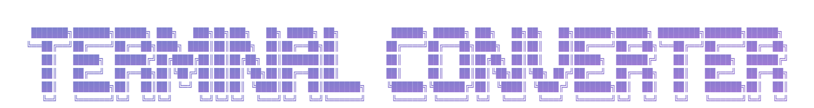

<div style="text-align: center;">
  <p align="center">
    
  </p>

<div style="text-align: center;">
  <p align="center">
    
  </p>
  <p align="center">
    <strong>A sleek terminal-style multimedia file converter</strong><br>
    Convert videos, audio, and images into various formats with real-time terminal feedback — all in your browser.
  </p>

  <p align="center">
    <a href="https://terminal-converter.onrender.com/" target="_blank">
      
    </a>
  </p>
</div>

---

## ✨ Features

- Convert video, audio, and image files to different formats  
- Custom codec flags like `h264` and `h265` are supported  
- Terminal-style interface with real-time feedback  

---

## 🚀 Getting Started

### 1. Clone the Repository

```bash
git clone https://github.com/YESWANTH-S/Terminal_Converter.git
cd Multimedia-File-Converter
```

### 2. Install Dependencies

```bash
pip install -r requirements.txt
```

### 3. Install FFmpeg

- **Ubuntu/Debian**: `sudo apt install ffmpeg`
- **macOS (Homebrew)**: `brew install ffmpeg`
- **Windows**:
  - Download FFmpeg from [https://ffmpeg.org/download.html](https://ffmpeg.org/download.html)
  - Add FFmpeg to your system PATH

### 4. Run the App

```bash
python app.py
```

Visit `http://127.0.0.1:5000` in your browser.

---

## 📁 Project Structure

```
.
├── app.py
├── readme.md
├── requirements.txt
│
├── converted/               # Stores converted files
├── uploads/                 # Temporarily stores uploaded files
│
├── static/
│   ├── css/
│   │   └── style.css
│   ├── js/
│   │   └── script.js
│   └── img/
│       └── welcome.svg
│
├── templates/
│   └── index.html
```

---

## 📦 Dependencies

- Flask  
- CairoSVG  
- FFmpeg

Install Python dependencies via:

```bash
pip install -r requirements.txt
```

---

## 🧰 Tech Stack

- **Backend**: Python (Flask)
- **Frontend**: HTML, CSS, JavaScript
- **Conversion Engine**: FFmpeg, CairoSVG

---

## 🔗 Demo

- **Demo Video**: [Terminal Converter](assets/demo.mp4)

https://github.com/user-attachments/assets/5394f407-a957-448c-a6fc-524e9465550e
---

## 🪪 License

This project is licensed under the [MIT License](LICENSE).

---

Contributions are welcome! If you have suggestions or improvements, feel free to open an issue or a pull request.