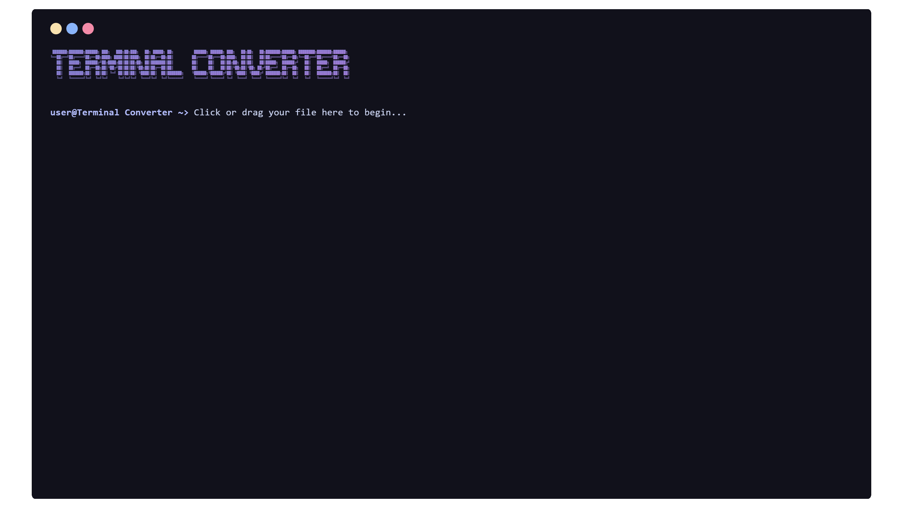

<p align="center">
  
</p>

<h1 align="center">Terminal Converter</h1>

<p align="center">
  
</p>

<p align="center"><strong>A sleek terminal-style multimedia file converter</strong></p>
<p align="center">
  Convert videos, audio, and images into various formats with real-time terminal feedback — all in your browser.
</p>

<p align="center">
  <a href="https://terminal-converter.onrender.com/" target="_blank">
    
  </a>
</p>

---

## ✨ Features

- Convert video, audio, and image files to various formats  
- Terminal-style interface with real-time conversion feedback  
- Smart format detection and dynamic UI options based on file type  
- Custom codec support with flags like `h264` and `h265`  
- Convert videos to audio or image formats with proper handling  
- SVG to PNG, PS, or PDF conversion with CairoSVG integration  
- Web-based and lightweight.
- Handles multiple conversions without page reloads 
- Beautifully themed with Catppuccin for a modern, cozy vibe


## 🚀 Getting Started

### 1. Clone the Repository

```bash
git clone https://github.com/YESWANTH-S/Terminal-Converter.git
cd Terminal-Converter
```

### 2. Install Dependencies

```bash
pip install -r requirements.txt
```

### 3. Install FFmpeg

- **Ubuntu/Debian**: `sudo apt install ffmpeg`
- **macOS (Homebrew)**: `brew install ffmpeg`
- **Windows**:
  - Download FFmpeg from [https://ffmpeg.org/download.html](https://ffmpeg.org/download.html)
  - Add FFmpeg to your system PATH

### 4. Run the App

```bash
python app.py
```

Visit `http://127.0.0.1:5000` in your browser.


## 📁 Project Structure

```
.
├── app.py
├── readme.md
├── requirements.txt
│
├── converted/               # Stores converted files
├── uploads/                 # Temporarily stores uploaded files
│
├── static/
│   ├── css/
│   │   └── style.css
│   ├── js/
│   │   └── script.js
│   └── img/
│       └── welcome.svg
│
├── templates/
│   └── index.html
```

## 🔄 Supported Formats & Conversion Types

### 🎥 Video

**Supported Formats:**  
`mp4`, `mkv`, `mov`, `avi`, `flv`, `wmv`, `webm`, `gif`

**Supported Codecs:**  
`h264`, `h265`

**Conversion Types:**

- Convert to: `mp4`, `mkv`, `mov`, `avi`, `flv`, `wmv`, `webm`, `gif`
- Convert to audio: `mp3`, `wav`, `flac`, `aac`, `ogg`, `opus`, `wma`

### 🎧 Audio

**Supported Formats:**  
`mp3`, `wav`, `flac`, `aac`, `ogg`, `opus`, `wma`

**Conversion Types:**

- Convert to: `mp3`, `wav`, `flac`, `aac`, `ogg`, `opus`, `wma`

### 🖼️ Image

**Supported Formats:**  
`jpeg`, `jpg`, `png`, `webp`, `svg`, `bmp`, `tiff`, `gif`

**Conversion Types:**

- Convert to: `jpeg`, `jpg`, `png`, `webp`, `bmp`, `tiff`, `gif`
- `svg` can be converted to: `png`, `ps`, `pdf`

### 📽️ GIF

**Conversion Types:**

- Convert to video: `mp4`, `mkv`, `mov`, `avi`, `flv`, `wmv`, `webm`
- Convert to image: `jpeg`, `jpg`, `png`, `webp`, `bmp`, `tiff` *(output is zipped)*


## 📦 Dependencies

- Flask  
- CairoSVG  
- FFmpeg

Install Python dependencies via:

```bash
pip install -r requirements.txt
```

## 🧰 Tech Stack

- **Backend**: Python (Flask)
- **Frontend**: HTML, CSS, JavaScript
- **Conversion Engine**: FFmpeg, CairoSVG


## 🔗 Demo

- **Demo Video**: [Terminal Converter](assets/demo.mp4)

https://github.com/user-attachments/assets/5394f407-a957-448c-a6fc-524e9465550e

## 🎨 Credits

<p> <a href="https://github.com/tharunartz">  </a> </p>
<p>Thanks for the logo</p>

## 📄 License

This project is licensed under the [MIT License](LICENSE).
